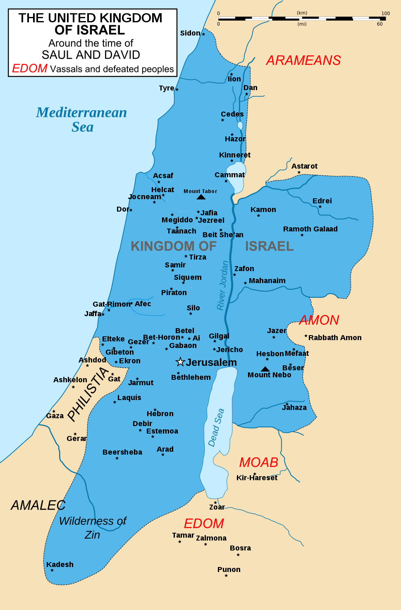

# Book

<!-- TOC -->

- [1. 1100th](#1-1100th)
  - [1.1. Samuel](#11-samuel)
  - [1.2. Saul](#12-saul)
  - [1.3. David](#13-david)
  - [1.4. Goliath](#14-goliath)
  - [1.5. Jonathan](#15-jonathan)

<!-- /TOC -->

https://archive.org/details/in.ernet.dli.2015.166000

Abraham, in the Bible, the first patriarch(族长；德高望重的男性长者), seen by Jews as the father of the Israelites through his son Isaac 亚伯拉罕,男子名,《圣经》中犹太人的始祖

Sarah, in the Bible, the wife and half-sister of Abraham, and mother of Isaac 撒拉(亚伯拉罕的妻子,以撒的母亲)

Hagar, in the Bible, an Egyptian servant of Sarah who bore Sarah's husband, Abraham, a son named Ishmael 【圣经】夏甲〔亚伯拉罕之妾,亚伯拉罕之妻萨拉出于妒嫉将其驱入沙漠〕

Ishmael, in the Bible, the son of Abraham, expelled into the desert after the birth of his brother Isaac, who was the forebear of twelve desert tribes. 以实玛利(亚伯拉罕和使女夏甲所生之子,阿拉伯人的祖先,儿时被其父亚伯拉罕摈弃)

Canaan, in the Bible, the part of ancient Palestine west of the Jordan River 迦南〔《圣经》中所说上帝赐给亚伯拉罕的地方,现在的巴勒斯坦西部〕巴勒斯坦古称迦南。

Rebekah, 利百加(以撒的妻子)

Esau, in the Bible, the son of Isaac and Rebekah, who sold his birthright to his brother, Jacob 以扫(以撒的长子,为了一碗红豆汤被其孪生兄弟雅各骗取了长子权)

Jacob, in the Bible, the second son of Isaac and Rebekah, and the grandson of Abraham. He tricked his older brother, Esau, out of his father's blessing, and had a vision of ascent into heaven that came to be called "Jacob's ladder".雅各(以撤之子,以扫的孪生兄弟,为以色列人的始祖,又名Israel)

Rachel, in the Bible, the daughter of Laban, wife of Jacob, and mother of Joseph and Benjamin

joseph, in the Bible, the son of Jacob and Rachel, sold into slavery in Egypt by his jealous brothers

Benjamin, in the Bible, the youngest son of Jacob and Rachel and father of the smallest tribe of Israel

Potiphar, in the Bible, the Egyptian who bought Joseph as a slave and later imprisoned him when he was falsely accused of attempting to have sexual relations with his wife..普提法尔

## 1. 1100th

### 1.1. Samuel

撒母耳〔《圣经》中人物,希伯来先知和领袖〕 in the Bible, the leader of the Israelites in the 11th century . He was the first prophet after Moses.

### 1.2. Saul

扫罗(希伯来人第一个国王)

### 1.3. David

大卫（希伯来语：דָּוִד‎）以色列联合王国第二代君主。

### 1.4. Goliath

哥利亚 in the Bible, a giant Philistine who was slain by David using a sling and a stone

### 1.5. Jonathan

约拿单 in the Bible, the eldest son of King Saul and close friend of David, who was killed in battle against the Philistines

