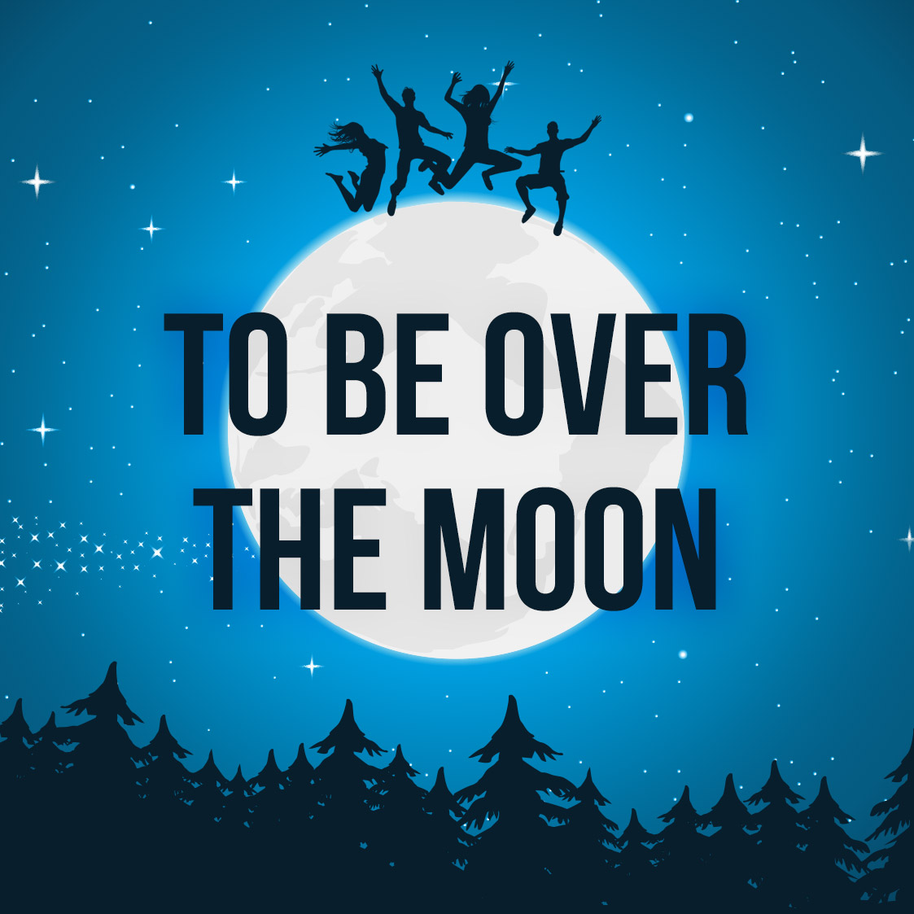

# be over the moon

- Word: be over the moon
- Meaning: to be very happy about something; To be extremely happy.
- Chinese: 非常高兴
- Tags: 
- Eg.: I've been over the moon ever since I got engaged—I just can't stop looking at my ring!
- Picture: 
- Picture: 
