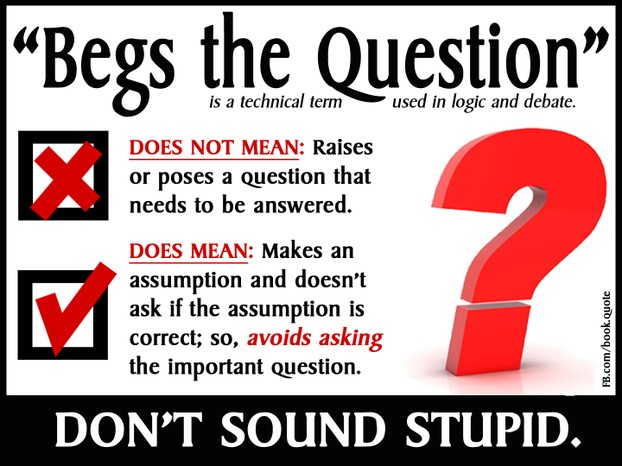
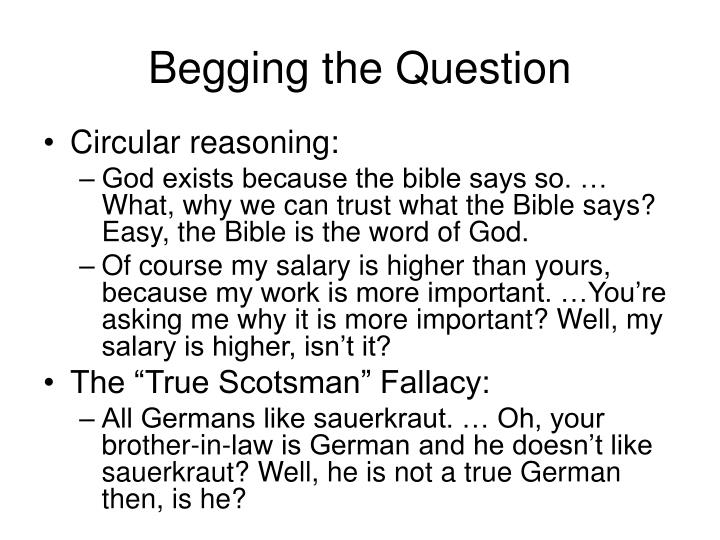

# beg the question

- Word: beg the question
- Meaning: to take for granted the very point that needs to be proved, and so fail to address an issue properly
- Chinese: (故意回避论点时)以假定为论据的狡辩
- Tags: 
- Eg.: 
- Picture: 
- Picture: 
