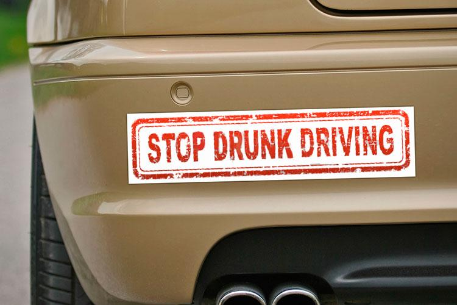

# bumper sticker

- Word: bumper sticker
- Meaning: a small sign that you can stick on your car with a message on it that may be funny, political, or advertising something
- Chinese: 〔汽〕粘贴在汽车保险杠上的小标语
- Tags: car
- Eg.: 
- Picture: 