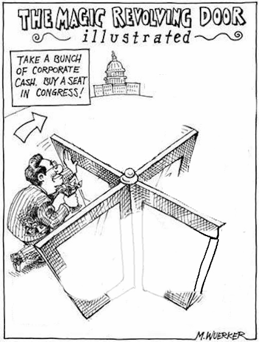

# revolving door

- Word: revolving door
- Meaning: a type of door in an entrance to a large building that turns around in a circle as people go through it
- Chinese: 旋转门；中转站（指人们进入后很快又离开的地方或机构）used to talk about a place or an organization that people enter and then leave again very quickly
- Tags: building
- Eg.: 
