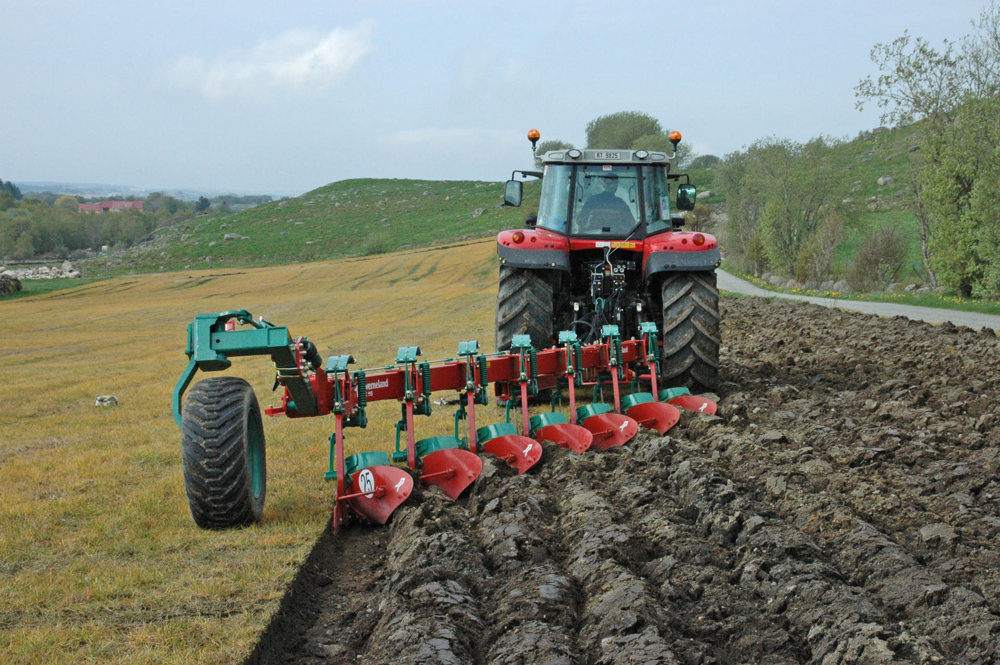

# agriculture

- agriculture: 农业；农学；农艺 the science or practice of farming
- plantation: 种植园，种植场（尤指热带国家种植咖啡、甘蔗、橡胶等的大庄园）a large area of land, especially in a hot country, where crops such as coffee, sugar, rubber, etc. are grown

## 灌溉

- irrigation: 灌溉；水利 the practice of supplying land with water so that crops and plants will grow
- pump: 抽水机；泵；打气筒 a machine that is used to force liquid, gas or air into or out of sth

## soil

- soil: 土壤 the top layer of the earth in which plants, trees, etc. grow
- till: 耕作；犁地 to prepare and use land for growing crops
- plow: 犁地；耕作；耕犁 to break up soil and turn it over into furrows
- furrow: 犁沟；沟；车辙 a long narrow cut in the ground, especially one made by a plough for planting seeds in
- plough: 犁 a large piece of farming equipment with one or several curved blades, pulled by a tractor or by animals. It is used for digging and turning over soil, especially before seeds are planted.

我觉得，plow和plough是同一个词的变形。

## 肥料

- fertilizer: 肥料 a substance added to soil to make plants grow more successfully
