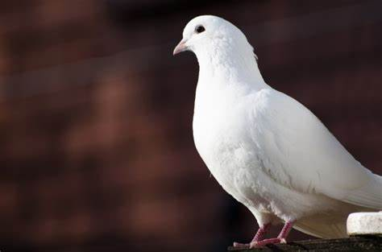
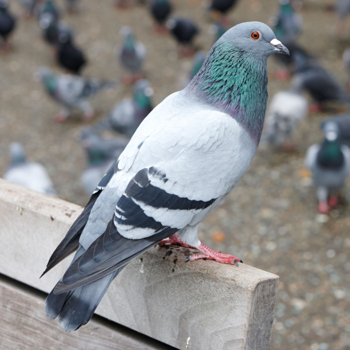

# animal bird

鸽子: dove是白色的鸽子，而pigeon是灰色的鸽子

- dove: 鸽子（白鸽常作为和平的象征）a bird of the pigeon family. The white dove is often used as a symbol of peace. 鸽派人物，温和派人物（尤指愿意和平与谈判而不愿战争的从政者）a person, especially a politician, who prefers peace and discussion to war

- pigeon: 鸽子 a fat grey and white bird with short legs. Pigeons are common in cities and also live in woods and fields where people shoot them for sport or food.

- woodpecker: 啄木鸟 a bird with a long beak that it uses to make holes in trees when it is looking for insects to eat

## water

- crane: 鹤 a large bird with long legs and a long neck 起重机；吊车 a tall machine with a long arm, used to lift and move building materials and other heavy objects

## Attack

- hawk: 鹰；隼 a strong fast bird of prey(= a bird that kills other creatures for food)
- eagle: 雕 a large bird of prey(= a bird that kills other creatures for food) with a sharp curved beak and very good sight

## Night

- owl: 猫头鹰，鸮（传统上认为是智慧的象征）a bird of prey(= a bird that kills other creatures for food) with large round eyes, that hunts at night. Owls are traditionally thought to be wise.
