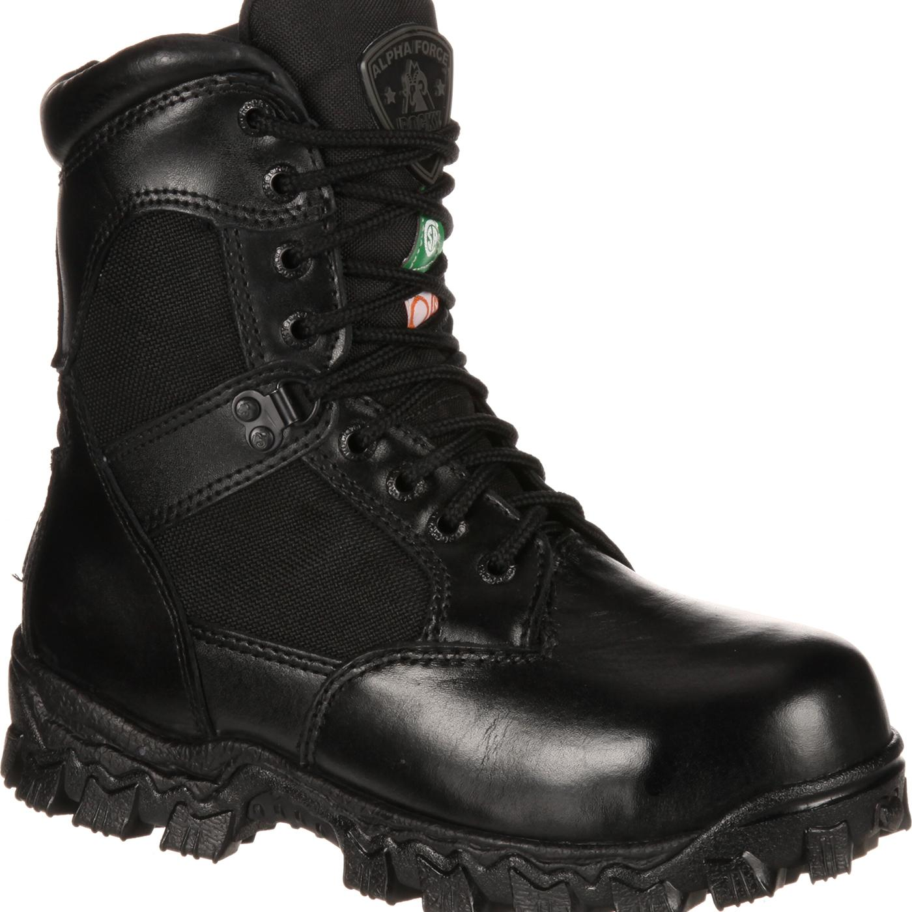

# cloth

- uniform: 制服；校服 the special set of clothes worn by all members of an organization or a group at work, or by children at school
- sleeve: 袖子 a part of a piece of clothing that covers all or part of your arm

- fabric: 织物；布料 material made by weaving wool, cotton, silk, etc., used for making clothes, curtains, etc. and for covering furniture

## upper

- tie: 领带 a long narrow piece of cloth worn around the neck, especially by men, with a knot in front
- shirt: （尤指男式的）衬衫 a piece of clothing (usually for men), worn on the upper part of the body, made of light cloth, with sleeves and usually with a collar and buttons down the front
- sweater: 毛衣，线衣（英式英语指套头无扣的；美式英语可指开襟有扣的）a knitted piece of clothing made of wool or cotton for the upper part of the body, with long sleeves. In British English the word is used to describe a piece of clothing with no buttons. In American English a sweater can have buttons and be like a jacket.

## lower

## foot

- boot: 靴子 a strong shoe that covers the foot and ankle and often the lower part of the leg 它比一般的鞋子要高一点，能够保护怀踝关节

- shoe: 鞋 one of a pair of outer coverings for your feet, usually made of leather or plastic
