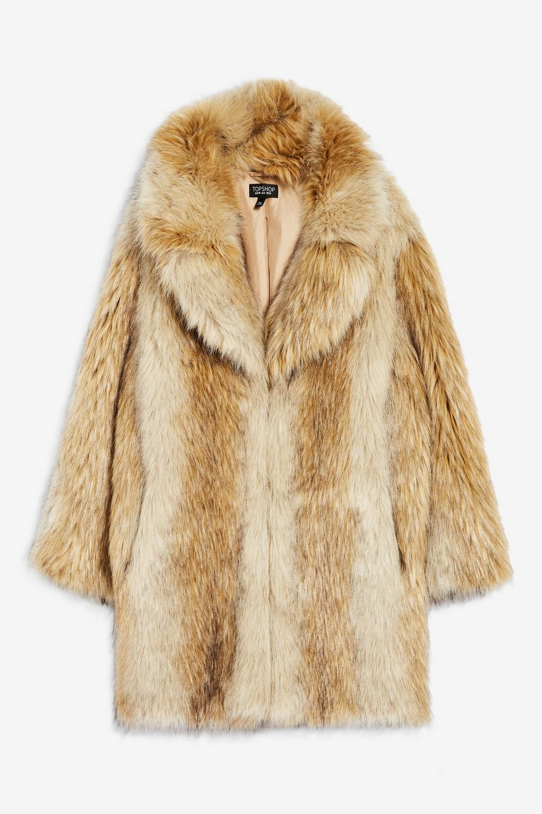

# cloth costume

- costume: （某地或某历史时期的）服装，装束 the clothes worn by people from a particular place or during a particular historical period
- uniform: 制服；校服 the special set of clothes worn by all members of an organization or a group at work, or by children at school
- attire: 服装；衣服 clothes
- suit: 西服；西装；套装 a set of clothes made of the same cloth, including a jacket and trousers/pants or a skirt
- overall: 外套；罩衣 a loose coat worn over other clothes to protect them from dirt, etc. 工装服；连身工作服 a loose piece of clothing like a shirt and trousers/pants in one piece, made of heavy cloth and usually worn over other clothing by workers doing dirty work

- underwear: 内衣；衬衣 clothes that you wear under other clothes and next to the skin

- fur coat: 皮大衣；皮衣；毛皮大衣

- overall: 外套；罩衣a loose coat worn over other clothes to protect them from dirt, etc.
