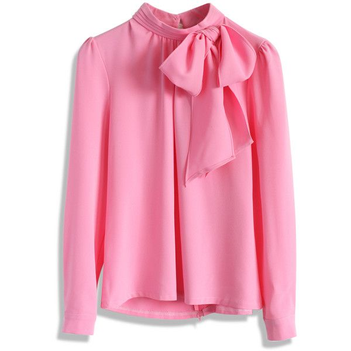
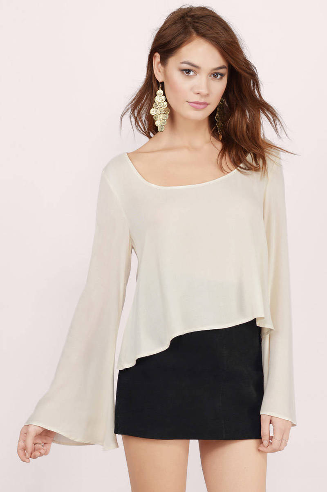
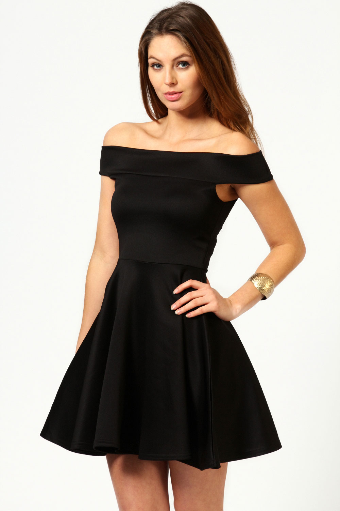
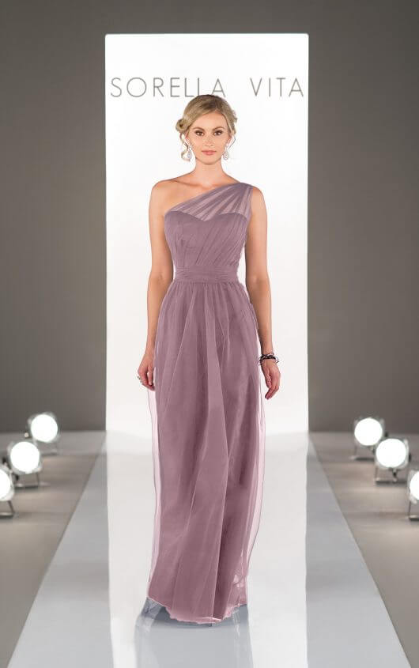
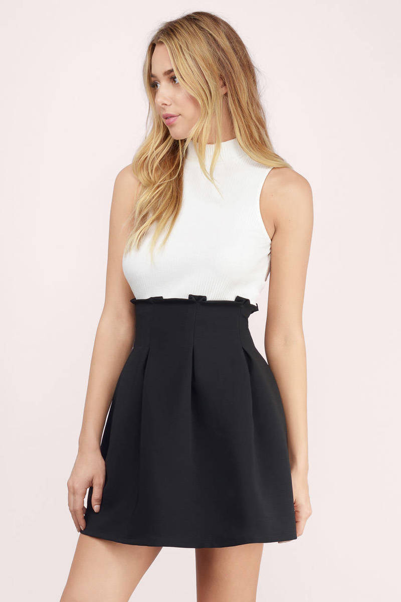
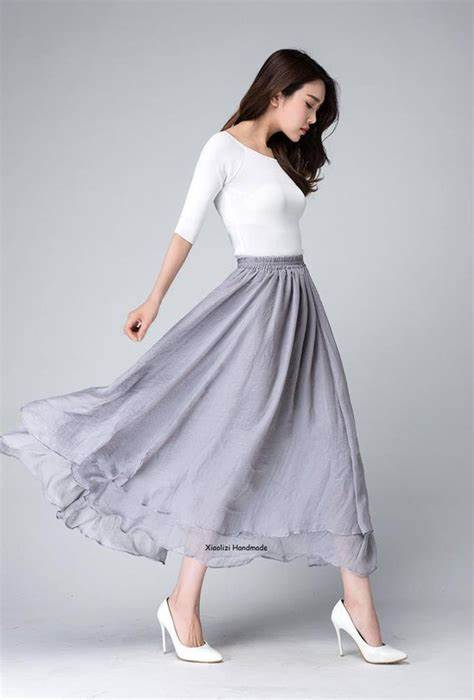
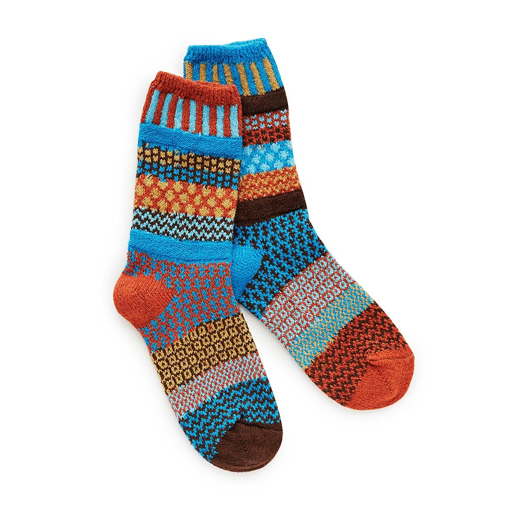
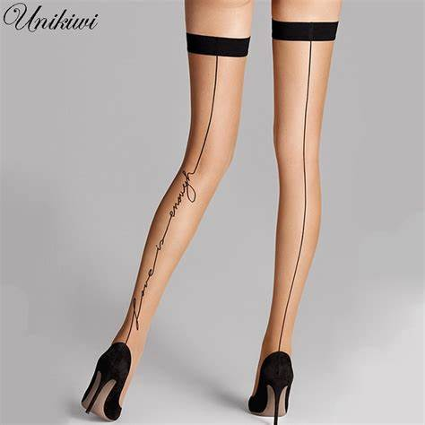
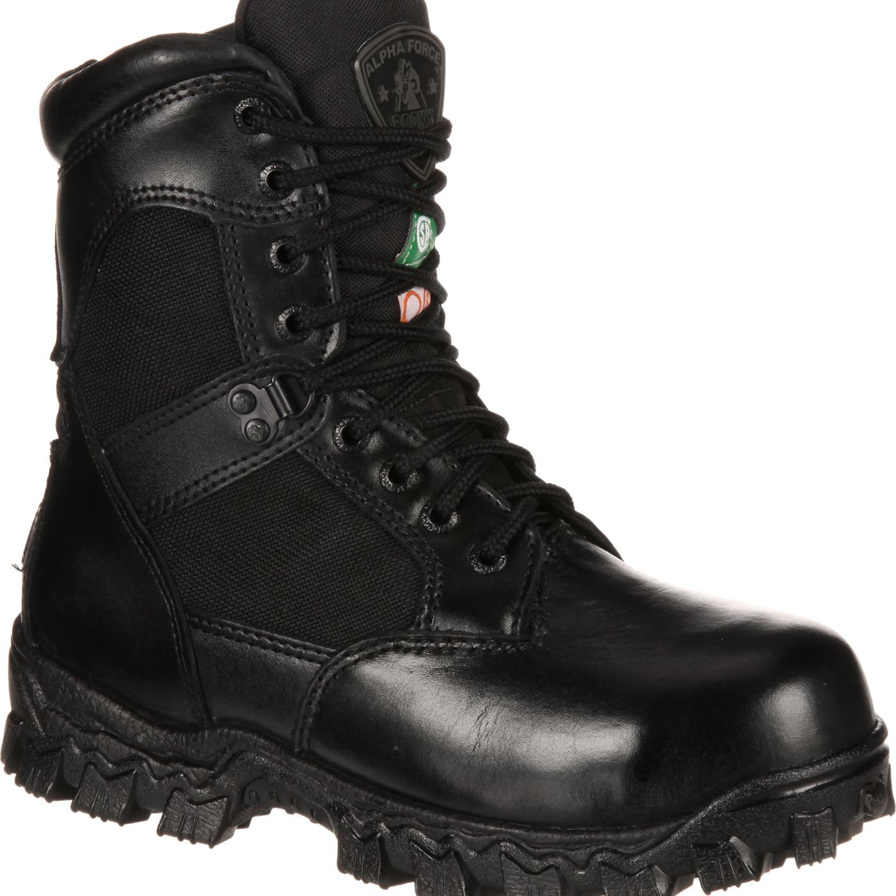
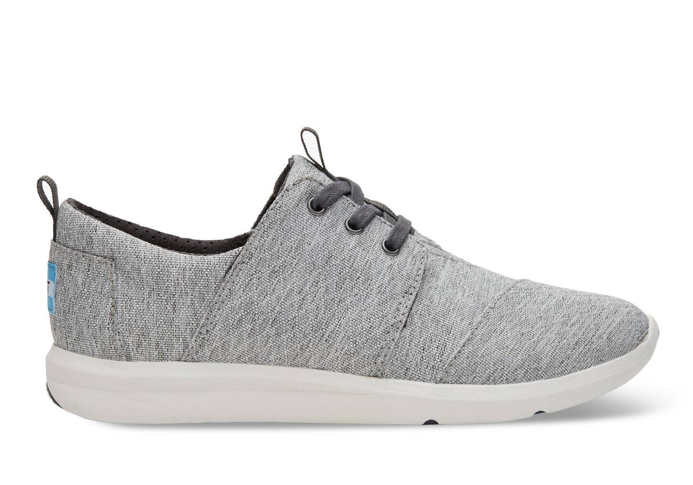

# cloth parts

## neck

- collar: 衣领；领子 the part around the neck of a shirt, jacket or coat that usually folds down
- tie: 领带 a long narrow piece of cloth worn around the neck, especially by men, with a knot in front

## arms

- sleeve: 袖子 a part of a piece of clothing that covers all or part of your arm

## hand

- glove: （分手指的）手套 a covering for the hand, made of wool, leather, etc. with separate parts for each finger and the thumb

## upper

- sweater: 毛衣，线衣（英式英语指套头无扣的；美式英语可指开襟有扣的）a knitted piece of clothing made of wool or cotton for the upper part of the body, with long sleeves. In British English the word is used to describe a piece of clothing with no buttons. In American English a sweater can have buttons and be like a jacket.
- jacket: 夹克衫；短上衣 a piece of clothing worn on the top half of the body over a shirt, etc. that has sleeves and fastens down the front; a short, light coat
- coat: 外套；外衣；大衣 a piece of outdoor clothing that is worn over other clothes to keep warm or dry. Coats have sleeves and may be long or short.

男式

- shirt: （尤指男式的）衬衫 a piece of clothing (usually for men), worn on the upper part of the body, made of light cloth, with sleeves and usually with a collar and buttons down the front

女式

- blouse: （女式）短上衣，衬衫 a piece of clothing like a shirt, worn by women

 关于blouse，它有许多不同的样式，下面就是两种。

- dress: 连衣裙 a piece of women's clothing that is made in one piece and covers the body down to the legs, sometimes reaching to below the knees, or to the ankles

## legs

- trousers: 裤子a piece of clothing that covers the body from the waist down and is divided into two parts to cover each leg separately
- pants: 裤子trousers
- jeans: 牛仔裤；粗斜纹棉布裤 trousers/pants made of strong cotton, especially denim

- skirt: 女裙；裙子 a piece of clothing for a woman or girl that hangs from the waist

关于裙子，也有长的，有短的。

## foot

袜子

- sock: 短袜 a piece of clothing that is worn over the foot, ankle and lower part of the leg, especially inside a shoe

- stocking: 长筒女袜 either of a pair of thin pieces of clothing that fit closely over a woman's legs and feet
- silk stockings: 丝袜

鞋子

- boot: 靴子 a strong shoe that covers the foot and ankle and often the lower part of the leg 它比一般的鞋子要高一点，能够保护怀踝关节

- shoe: 鞋 one of a pair of outer coverings for your feet, usually made of leather or plastic
- sneaker: 运动鞋；便鞋 a shoe that you wear for sports or as informal clothing

