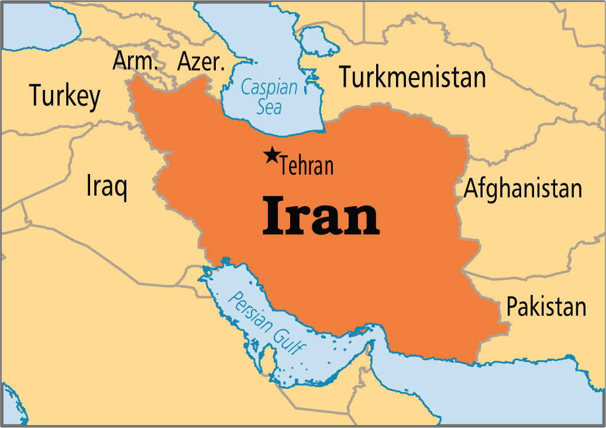
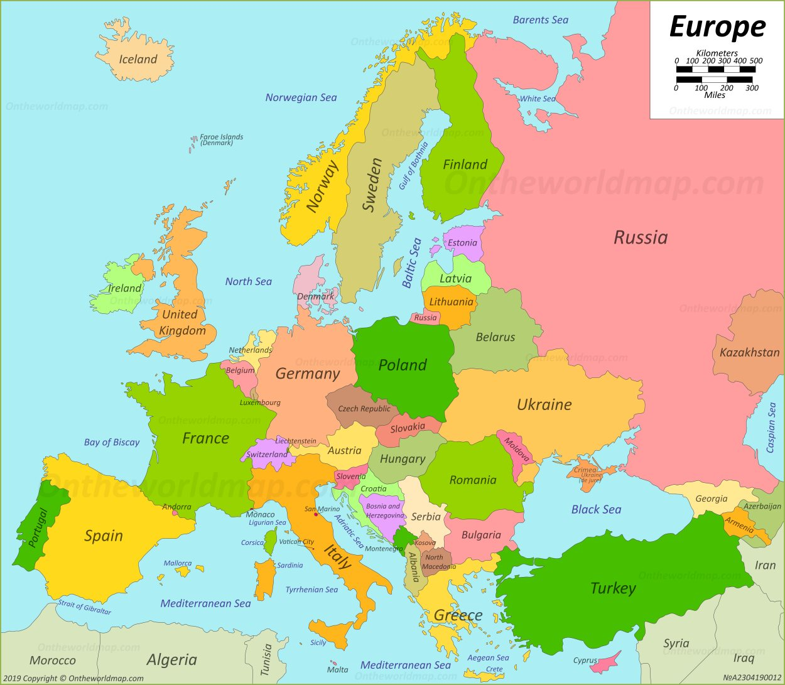

# country

## Asia

- Iran: 伊朗；【国】伊朗；伊朗伊斯兰共和国 country in Southwest Asia, located south of the Caspian Sea, northeast of the Persian Gulf, and north of the Gulf of Oman.

- Kazakhstan: 哈萨克斯坦〔亚洲国名〕 country in Central Asia, bordered by Russia, China, Kyrgyzstan(吉尔吉斯斯坦), Uzbekistan(乌兹别克斯坦), Turkmenistan(土库曼斯坦), and the Caspian Sea(里海).

## Europe

- Italy: 意大利(南欧地中海岸一国家,首都为Rome) country in southern Europe. Its mainland area projects as a peninsula into the Mediterranean Sea, and it includes, among others, the islands of Elba, Sicily, and Sardinia.

- Spain: 西班牙(西南欧一国家,首都为Madrid) country in southwestern Europe on the Iberian Peninsula, east of Portugal.

## Africa

- Uganda: 乌干达(东非一独立国,为英联邦之一员,首都为Kampala)
country in East Africa. It became a member of the British Commonwealth in 1962 and a republic in 1967.

- Liberia: 利比里亚(西非一国家,首都为Monrovia) country in West Africa, on the North Atlantic Ocean.

