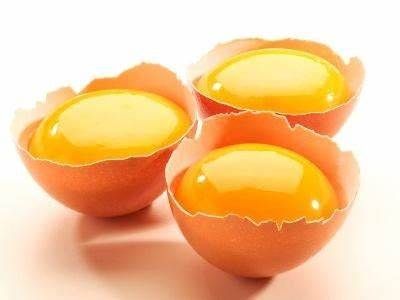
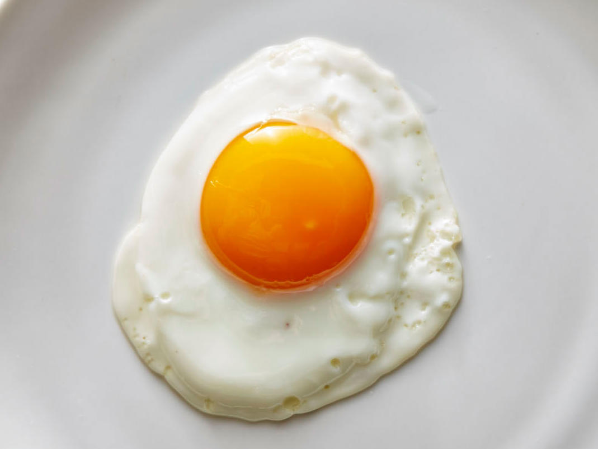

# food egg

- yolk: 蛋黄 the round yellow part in the middle of an egg

- sunny side up: 单煎一面蛋黄在上的煎鸡蛋，sunny side就是“太阳那一面”，up就是“朝上”。If you order eggs "sunny side up," those "suns" are the egg yolks.

