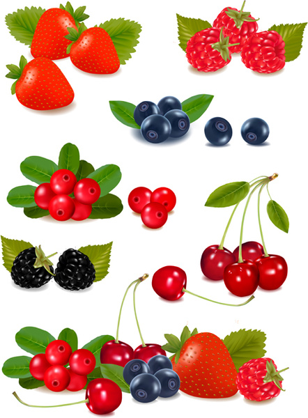
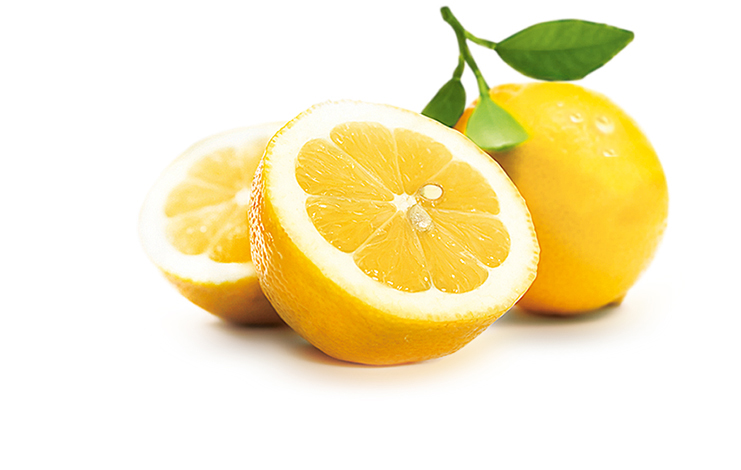
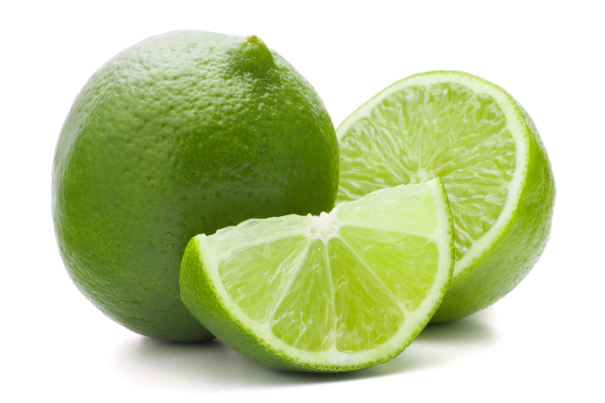

# food fruit

## 水果制成品

- jam: 果酱 a thick sweet substance made by boiling fruit with sugar, often sold in jars and spread on bread
- jelly: 果冻 a cold sweet transparent food made from gelatin, sugar and fruit juice, that shakes when it is moved
- sauce: 调味汁；酱 a thick liquid that is eaten with food to add flavour to it

## 水果

- watermelon: 西瓜 a type of large melon with hard, dark green skin, red flesh and black seeds
- banana: 香蕉 a long curved fruit with a thick yellow skin and soft flesh, that grows on trees in hot countries
- grape: 葡萄 a small green or purple fruit that grows in bunches on a climbing plant (called a vine ). Wine is made from grapes.

- peach: 桃；桃子 a round fruit with soft red and yellow skin, yellow flesh and a large rough seed inside

## 莓

- berry: 浆果；莓 a small fruit that grows on a bush. There are several types of berry , some of which can be eaten.

- strawberry: 草莓 a soft red fruit with very small yellow seeds on the surface, that grows on a low plant

## 酸的水果

- lemon: 柠檬 a yellow citrus fruit with a lot of sour juice. Slices of lemon and lemon juice are used in cooking and drinks.

- lime: 酸橙 a small green fruit, like a lemon, with a lot of sour juice, used in cooking and in drinks; the juice of this fruit

