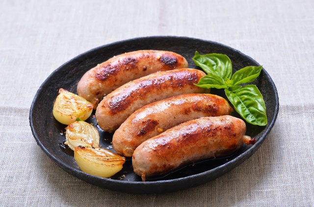
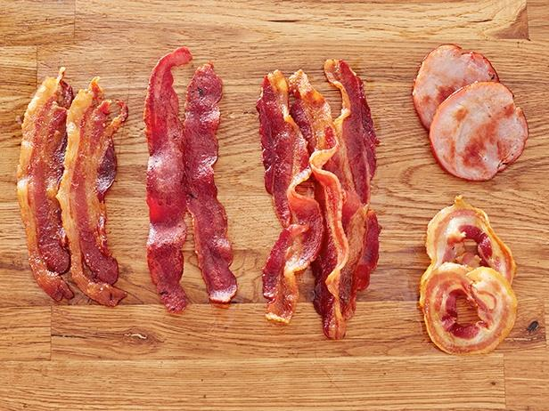

# food meat

- meat: 肉；（某种）食用肉 the flesh of an animal or a bird eaten as food
- heavy meal: 难消化的膳食；不易消化的膳食；有点儿腻的菜

- sausage: 香肠；腊肠 a mixture of finely chopped meat, fat, bread, etc. in a long tube of skin, cooked and eaten whole or served cold in thin slices

## 牛肉

- beef: 牛肉 meat that comes from a cow
- steak: 牛排 a thick slice of good quality beef

## 猪肉

- bacon: 咸猪肉；熏猪肉 meat from the back or sides of a pig that has been cured(用腌,熏等法保藏) (= preserved using salt or smoke), usually served in thin slices

