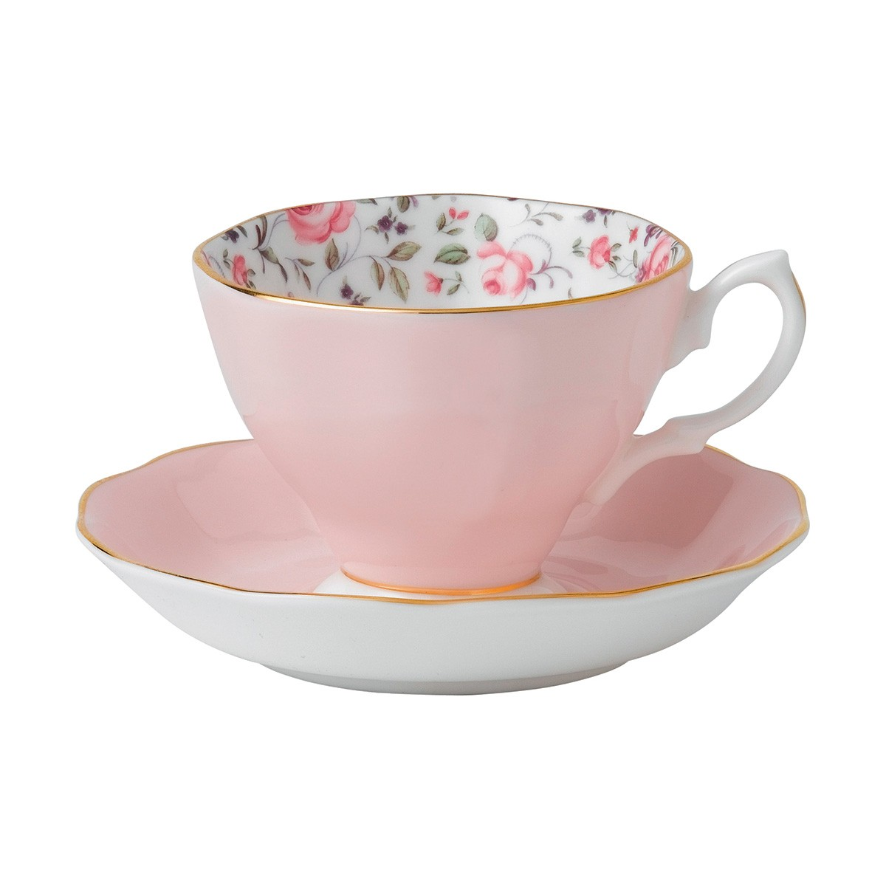

# food utensil

- utensil: （家庭）用具，器皿；家什 a tool that is used in the house

## 刀/勺/叉

刀

- knife: 刀 a sharp blade with a handle, used for cutting or as a weapon

勺

- spoon: 勺；匙 a tool that has a handle with a shallow bowl at the end, used for stirring, serving and eating food

叉

- fork: 餐叉 a tool with a handle and three or four sharp points (called prongs ), used for picking up and eating food

- stainless: 不锈钢；不锈的 resisting rust or corrosion
- stain: 污点；污渍 a dirty mark on sth, that is difficult to remove
- stainless steel: 不锈钢 a type of steel that does not rust (= change colour)

## 容器

- lid: （容器的）盖，盖子 a cover over a container that can be removed or opened by turning it or lifting it

## 盘子/碟子

- dish: 碟；盘 a flat shallow container for cooking food in or serving it from 一道菜；菜肴 food prepared in a particular way as part of a meal

- saucer: 茶碟；茶托；碟状物 a small shallow round dish that a cup stands on; an object that is shaped like this

- tray: 盘；托盘；碟 a flat piece of wood, metal or plastic with raised edges, used for carrying or holding things, especially food

