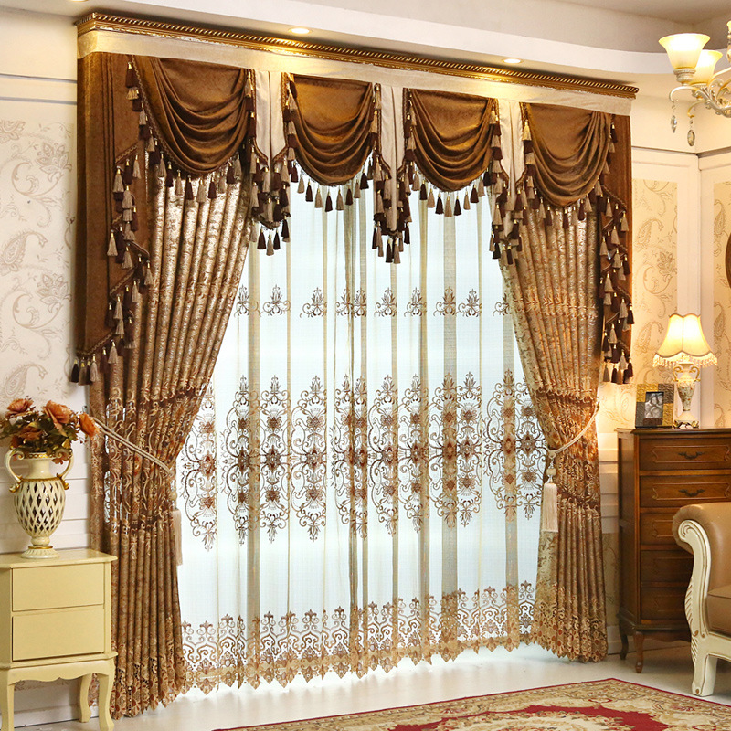

# house furniture

- furnish: 在（房屋等）处布置家具 to put furniture in a house, room, etc.
- furniture: （可移动的）家具 objects that can be moved, such as tables, chairs and beds, that are put into a house or an office to make it suitable for living or working in

## bed

- bed: 床 a piece of furniture for sleeping on
- pillow: 枕头 a square or rectangular piece of cloth filled with soft material, used to rest your head on in bed
- blanket: 毯子；毛毯 a large cover, often made of wool, used especially on beds to keep people warm
- quilt: 加衬芯床罩 a decorative cover for a bed, made of two layers with soft material between them
- sheet: 床单；被单 a large piece of thin cloth used on a bed to lie on or lie under

## chair

- chair: 椅子 a piece of furniture for one person to sit on, with a back, a seat and four legs
- sofa: 长沙发 a long comfortable seat with a back and arms, for two or more people to sit on

## table

- table: 桌子；台子；几 a piece of furniture that consists of a flat top supported by legs
- drawer: 抽屉 a part of a piece of furniture such as a desk, used for keeping things in. It is shaped like a box and has a handle on the front for pulling it out.

## cabinet

- cabinet: 储藏柜；陈列柜 a piece of furniture with doors, drawers and/or shelves, that is used for storing or showing things

- cupboard: 橱柜；食物柜；衣柜 a piece of furniture with doors and shelves used for storing dishes, food, clothes, etc.

- wardrobe: 衣柜；衣橱；（英国）放置衣物的壁橱 a large cupboard for hanging clothes in which is either a piece of furniture or (in British English) built into the wall

## window

- curtain: 窗帘 a piece of cloth that is hung to cover a window

