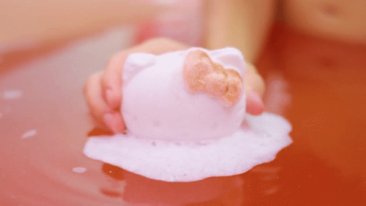
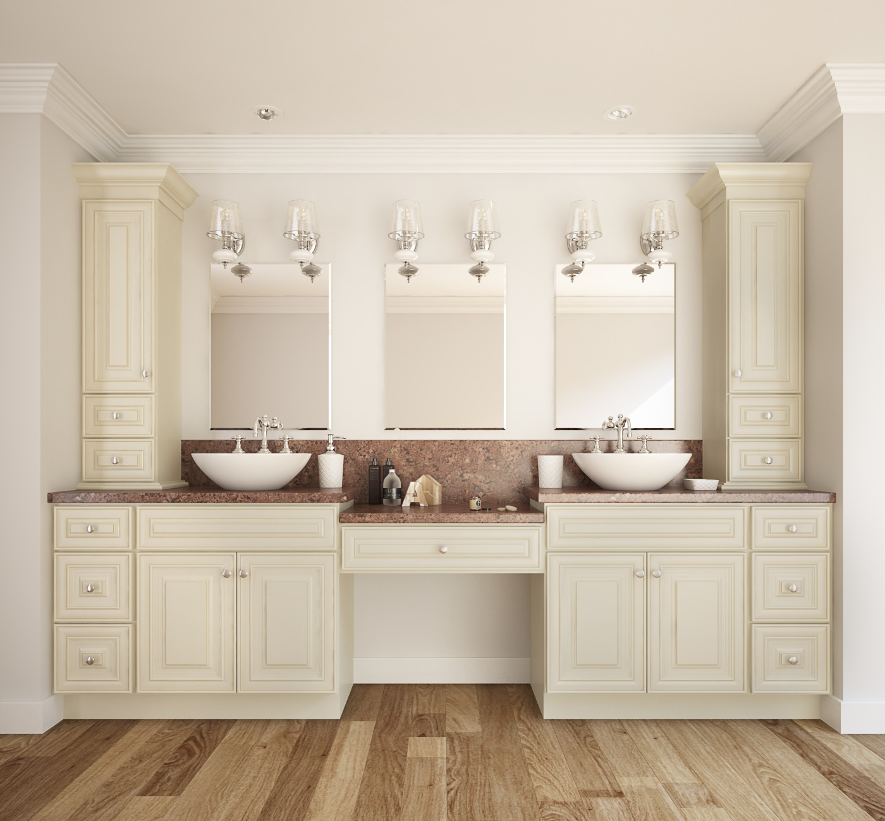

# house indoor

- curtain: 窗帘 a piece of cloth that is hung to cover a window

## kitchen

- kitchen: 厨房 a room in which meals are cooked or prepared
- kitchenware: （商店用语）厨房用具 used in shops/stores to describe objects that you use in a kitchen, such as pans, bowls, etc.

- refrigerator: 冷冻机；冷藏库；(电)冰箱；制冰机 a machine that keeps food and drinks cold, usually with a part for freezing food. A more informal word is fridge.
- fridge: 冰箱 a piece of electrical equipment in which food is kept cold so that it stays fresh

- closet: 贮藏室；壁橱 a small room or a space in a wall with a door that reaches the floor, used for storing things

- sink: （厨房里的）洗涤池，洗碗槽 a large open container in a kitchen that has taps/faucets to supply water and that you use for washing dishes in

## bathroom

- bathroom: 浴室 a room in which there is a bath/ bathtub , a washbasin and often a toilet 洗手间；卫生间 a room in which there is a toilet, a sink and sometimes a bath/ bathtub or shower

- bath bomb: 气泡弹；沐浴气泡弹

- lavatory: 抽水马桶；厕所；卫生间；洗手间；盥洗室 a toilet, or a room with a toilet in it

## clean

- broom: 扫把；扫帚 a brush on the end of a long handle, used for sweeping floors

- cabinet: 储藏柜；陈列柜a piece of furniture with doors, drawers and/or shelves, that is used for storing or showing things
- bathroom cabinet: 浴室柜；浴柜

- furnace: 熔炉 a space surrounded on all sides by walls and a roof for heating metal or glass to very high temperatures

