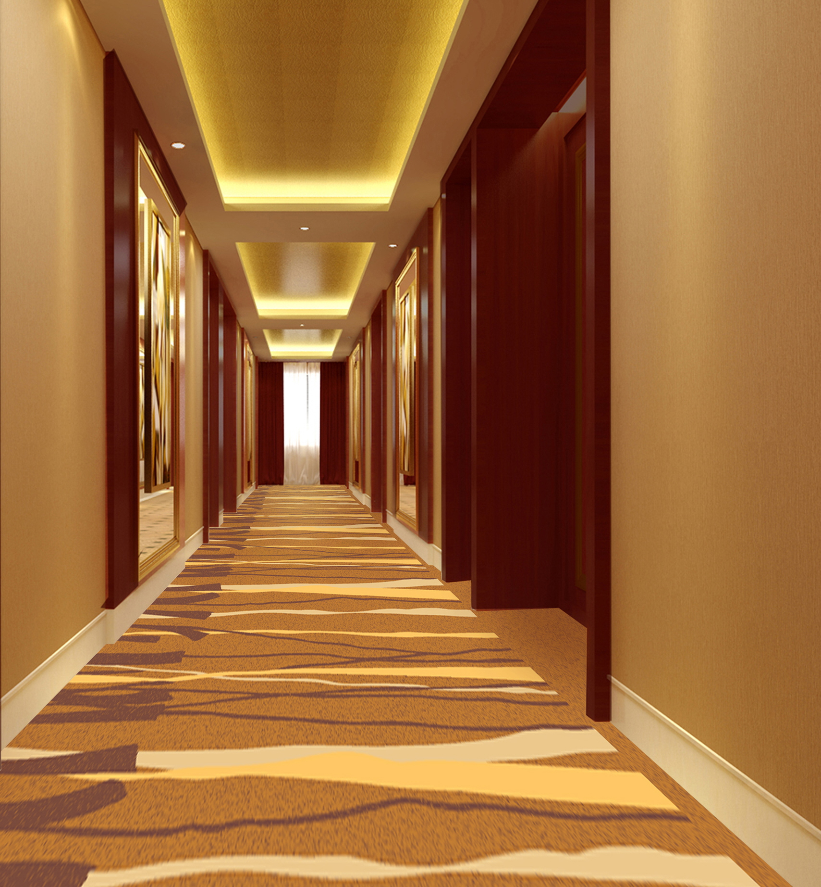

# house room

## 走廊

- corridor: （建筑物内的）走廊，过道，通道 a long narrow passage in a building, with doors that open into rooms on either side

## 会议

- chamber: 会议厅 a hall in a public building that is used for formal meetings

## 阳台

- balcony: 阳台 a platform that is built on the upstairs(二楼以上各层) outside wall of a building, with a wall or rail(栏杆) around it. You can get out onto a balcony from an upstairs room.
