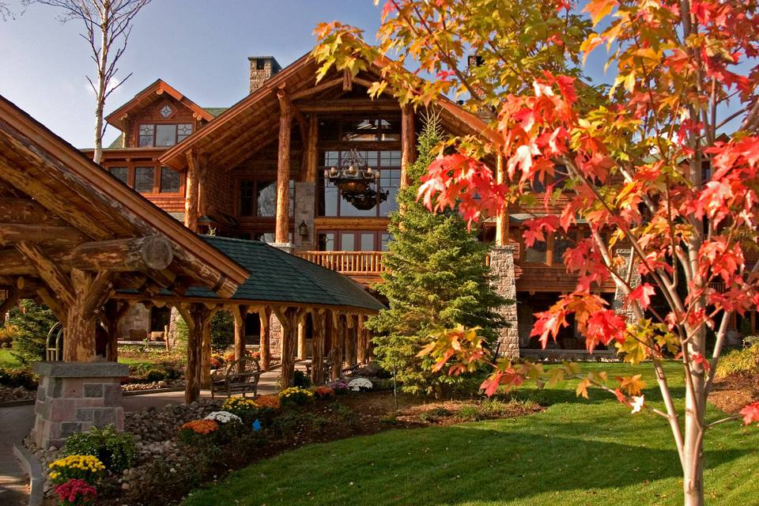
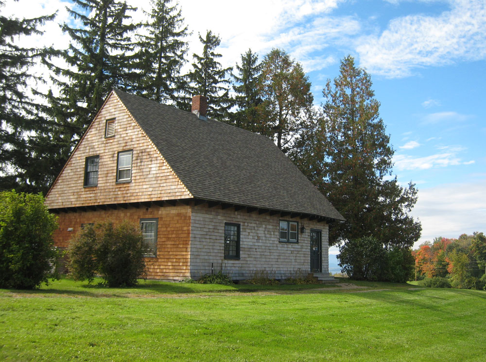
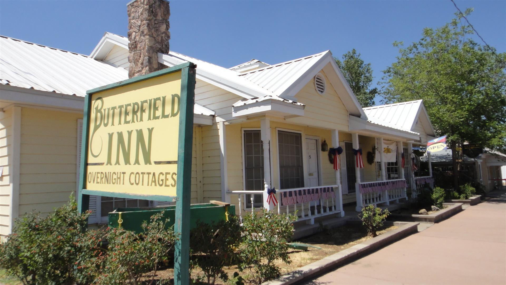
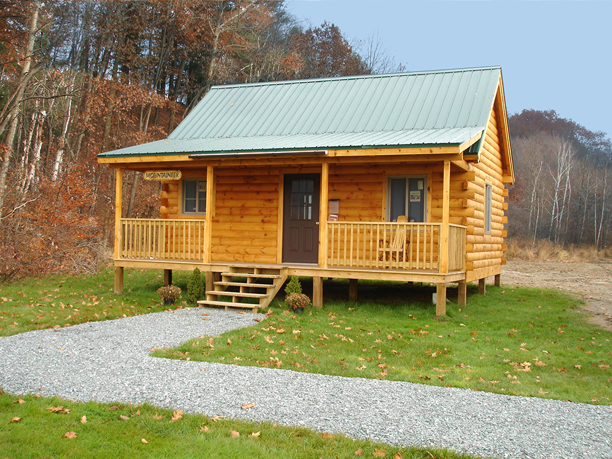
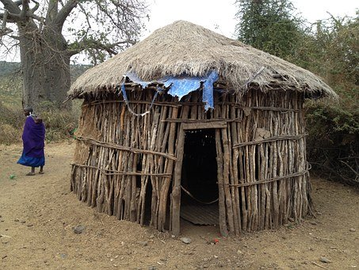

# house shelter

## 广泛意义的住所

- dwelling: 住宅；住所；公寓 a house, flat/apartment, etc. where a person lives

## 豪宅

- residence: 住所；住房；（尤指）宅第，豪宅 a house, especially a large or impressive one

## 乡间

- lodge: （供参加户外运动者暂住的）乡间小屋，小舍 a small house in the country where people stay when they want to take part in some types of outdoor sport

- cottage: 小屋；（尤指）村舍，小别墅 a small house, especially in the country

- inn: （通常指乡村的，常可夜宿的）小酒店 a pub, usually in the country and often one where people can stay the night

- cabin: （通常为木制的）小屋，小棚屋 a small house or shelter, usually made of wood

- hut: 简陋的小房子（或棚、舍）a small, simply built house or shelter

## 野外自然环境

- shelter: （尤指用以躲避风雨或攻击的）遮蔽物，庇护处，避难处a structure built to give protection, especially from the weather or from attack 居所；住处 the fact of having a place to live or stay, considered as a basic human need
- tent: 帐篷；帐棚 a shelter made of a large sheet of canvas, nylon , etc. that is supported by poles and ropes fixed to the ground, and is used especially for camping

- haven: 安全的地方；保护区；避难所 a place that is safe and peaceful where people or animals are protected
