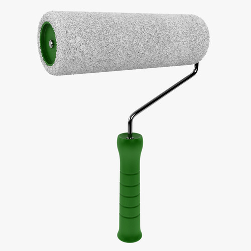
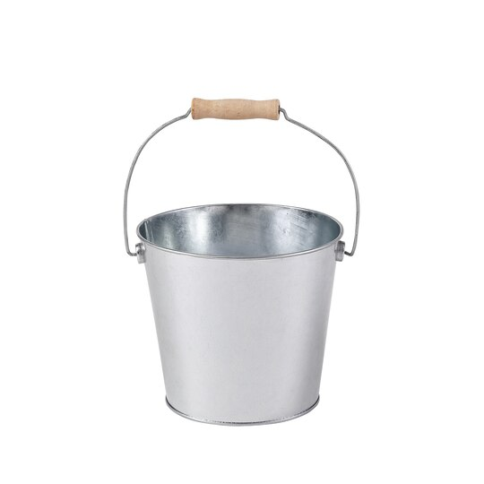
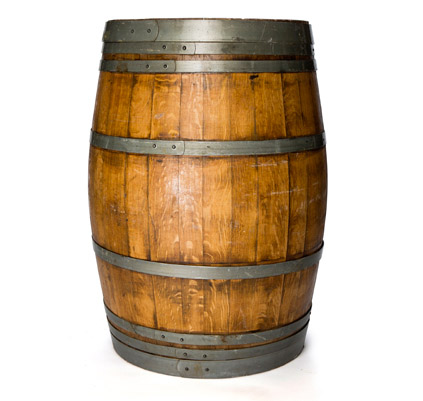

# house tools

## 斧子

- ax: 斧子 “axe”的变体 a tool consisting of a flat heavy metal head with a sharpened edge attached to a long handle, used to chop wood or fell trees

## 螺丝/锤子

- screw: 螺丝钉；螺丝 a thin pointed piece of metal like a nail with a raised spiral line (called a thread ) along it and a line or cross cut into its head. Screws are turned and pressed into wood, metal, etc. with a screwdriver in order to fasten two things together.
- screwdriver: 螺丝刀；改锥 a tool with a narrow blade that is specially shaped at the end, used for turning screws
- hammer: 锤子；榔头 a tool with a handle and a heavy metal head, used for breaking things or hitting nails

## 滚筒

- roller: 滚筒；滚轴 a piece of wood, metal or plastic, shaped like a tube, that rolls over and over and is used in machines, for example to make sth flat, or to move sth
- roller brush: 滚筒刷

## 装水的容器

- bucket: （有提梁的）桶 an open container with a handle, used for carrying or holding liquids, sand, etc.

- barrel: 桶 a large round container, usually made of wood or metal, with flat ends and, usually, curved sides

## 锹

- spade: 锹；铲 a garden tool with a broad metal blade and a long handle, used for digging
