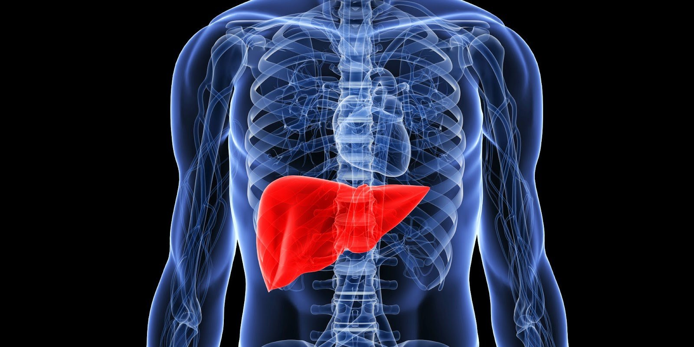

# human organ

- organ: （人体或动植物的）器官 a part of the body that has a particular purpose, such as the heart or the brain; part of a plant with a particular purpose

## head

- brain: 脑 the organ inside the head that controls movement, thought, memory and feeling

## body

- heart: 心；心脏 the organ in the chest that sends blood around the body, usually on the left in humans

- lung: 肺 either of the two organs in the chest that you use for breathing

- stomach: 胃；腹部 the organ inside the body where food goes when you swallow it; the front part of the body below the chest

- kidney: 肾；肾脏 either of the two organs in the body that remove waste products from the blood and produce urine

- liver: 肝 a large organ in the body that cleans the blood and produces bile

- bowel: 肠 the tube along which food passes after it has been through the stomach, especially the end where waste is collected before it is passed out of the body
- bowl: 碗；钵；盆 a deep round dish with a wide open top, used especially for holding food or liquid

- intestine: 肠 a long tube in the body between the stomach and the anus. Food passes from the stomach to the small intestine and from there to the large intestine.

- appendix: 阑尾 a small bag of tissue that is attached to the large intestine. In humans, the appendix has no clear function.

- anus: 肛门 the opening in a person's bottom through which solid waste leaves the body
