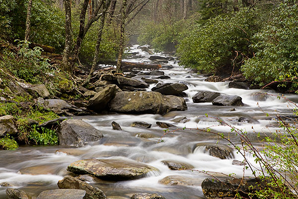

# nature freshwater

- freshwater: 淡水的 having water that is not salty 淡水中生长的 living in water that is not the sea and is not salty

## lake

- pond: 池塘；水池（尤指人工的）a small area of still water, especially one that is artificial

- lake: 湖；湖泊 a large area of water that is surrounded by land

- reservoir: 水库；蓄水池 a natural or artificial lake where water is stored before it is taken by pipes to houses, etc.

- basin: 流域 an area of land around a large river with streams running down into it

## river

- ditch: 沟；渠 a long channel dug at the side of a field or road, to hold or take away water

- stream: 小河；溪 a small narrow river

- river: 河；江 a natural flow of water that continues in a long line across land to the sea/ocean
- bed: （河）床；（海等的）底 the bottom of a river, the sea, etc.

- canal: 运河；灌溉渠 a long straight passage dug in the ground and filled with water for boats and ships to travel along; a smaller passage used for carrying water to fields, crops, etc.

## Other

- waterfall: 瀑布 a place where a stream or river falls from a high place, for example over a cliff or rock
