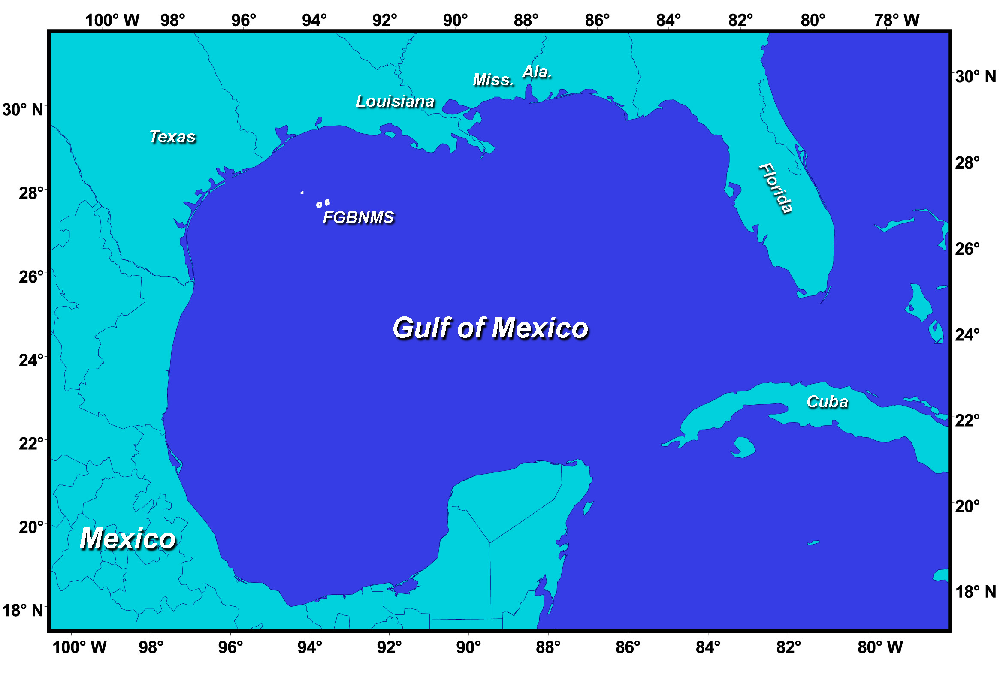

# sea

- calm sea: 无浪海面；风平浪静的海面
- marine: 海的；海产的；海生的 connected with the sea and the creatures and plants that live there

## sea

- sea: 海 a large area of salt water that is part of an ocean or surrounded by land
- ocean: 大海；海洋 the mass of salt water that covers most of the earth's surface （五大洋之一的）洋 one of the five large areas that the ocean is divided into

- atlantic: 大西洋的 relating to or situated in or near the Atlantic Ocean
- pacific: 平静的 peaceful or loving peace 太平洋；太平洋的 relating to the Pacific Ocean, or to the territories that surround it or are surrounded by it

## 海边

- harbor: 海港,港口;港湾 an area of water near the land where it is safe for boats to stay. A port is a harbor where passengers and goods can be taken on and off
- port: 港口城市；口岸城市 a town or city with a harbour , especially one where ships load and unload goods

- bay: （海或湖的）湾 a part of the sea, or of a large lake, partly surrounded by a wide curve of the land

## 人工

- dock: 船坞；船埠；码头 a part of a port where ships are repaired, or where goods are put onto or taken off them
- pier: （突入湖、河、海中的）码头；突码头 a long low structure built in a lake, river or the sea and joined to the land at one end, used by boats to allow passengers to get on and off

## 近陆地

beach和shore均可指“海滨”｡比较说来 , beach较为平坦,覆盖着沙子或碎石,适宜于游泳,日光浴｡ shore则是笼统的说法,既可以包括 beach,也可指岩石突兀或陡峭的岸边｡另外, shore也可以表示“湖边”｡ coast指海洋与陆地的分界线 ,意为“海岸”｡

例如:

- Many people were lying on the beach, bathing in the sun.
- After the storm a lot of drift wood was washed up on the shore.
- She lives ten miles from the coast.

- beach: 海滩；沙滩；海滨；湖滨 an area of sand or small stones (called shingle), beside the sea or a lake
- shingle: （海滨或河边的）卵石滩 a mass of small smooth stones on a beach or at the side of a river
- shore: （海洋、湖泊等大水域的）岸，滨 the land along the edge of the sea or ocean, a lake or another large area of water
- gulf: 海湾 a large area of sea that is partly surrounded by land

## 近水域

- tide: 潮；潮汐；潮水 a regular rise and fall in the level of the sea, caused by the pull of the moon and sun; the flow of water that happens as the sea rises and falls
- wave: 海浪；波浪；波涛 a raised line of water that moves across the surface of the sea, ocean, etc.

