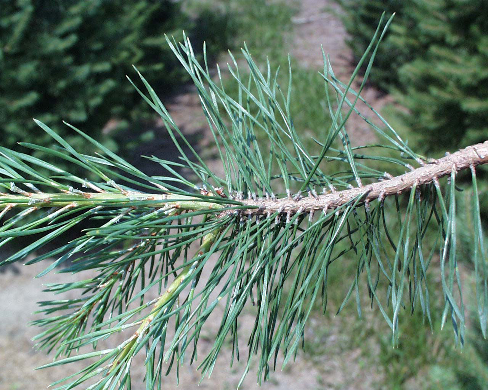
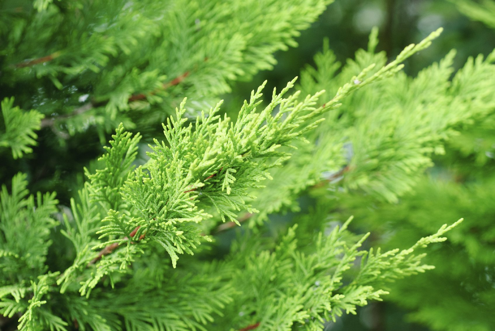

# plant tree

松柏: 松树叶是针型，且针叶分布在树枝的四周呈散射状，而柏树的每一个小鳞苞都是一片单独的叶子，它们紧紧地连着茎。

- pine: 松树 an evergreen forest tree with leaves like needles

- cypress: 柏树 a tall straight evergreen tree

柳树

- willow: 柳；柳树 a tree with long thin branches and long thin leaves, that often grows near water
- pillow: 枕头 a square or rectangular piece of cloth filled with soft material, used to rest your head on in bed

杨树

- poplar: 杨，杨树（树干高，木质较软）a tall straight tree with soft wood
- polar: 极地的；近地极的；南极（或北极）的 connected with, or near the North or South Pole

- walnut: 核桃树；胡桃树 the tree on which walnuts grow 核桃；胡桃 the light brown nut of the walnut tree that has a rough surface and a hard round shell in two halves

- oak: 栎树；橡树 a large tree that produces small nuts called acorns . Oaks are common in northern countries and can live to be hundreds of years old.
- acorn: 橡子；橡实 the small brown nut of the oak tree, that grows in a base shaped like a cup