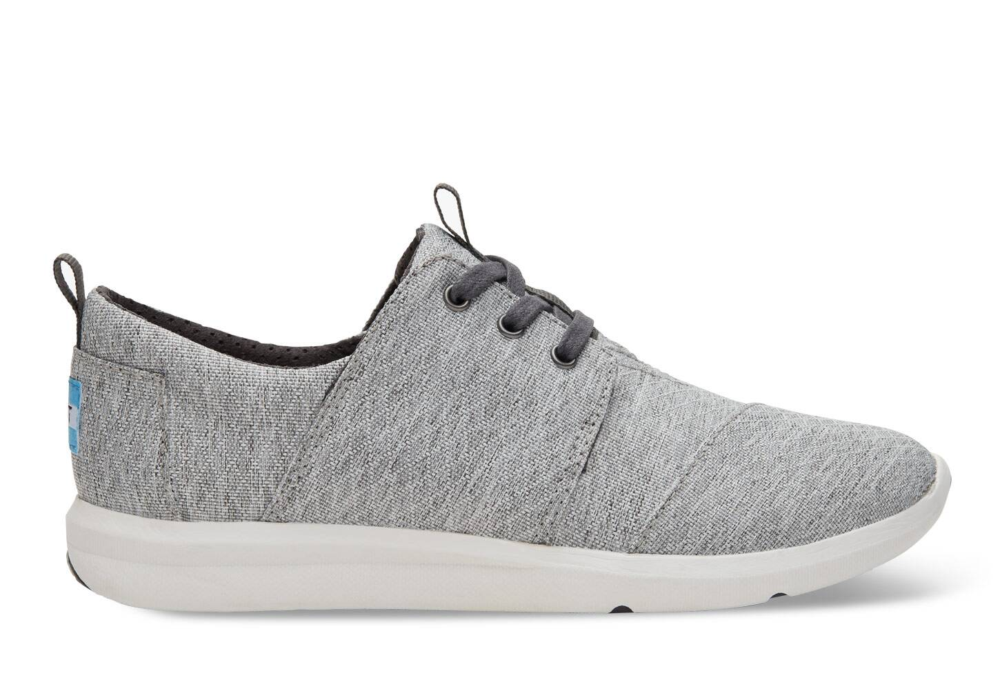

# shoes

鞋子

- boot: 靴子 a strong shoe that covers the foot and ankle and often the lower part of the leg 它比一般的鞋子要高一点，能够保护怀踝关节

- shoe: 鞋 one of a pair of outer coverings for your feet, usually made of leather or plastic
- sneaker: 运动鞋；便鞋 a shoe that you wear for sports or as informal clothing

- heel: （鞋、靴子等的）后跟 the raised part on the bottom of a shoe, boot, etc. that makes the shoe, etc. higher at the back 女高跟鞋 a pair of women's shoes that have high heels

- slipper: （室内）便鞋，拖鞋 a loose soft shoe that you wear in the house

