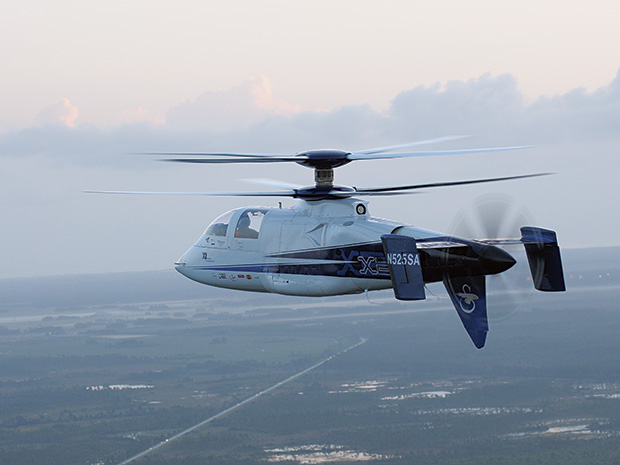

# vehicle air

## 太空

- spacecraft: 宇宙飞船；太空船 a vehicle that travels in space
- space station: 太空站；宇宙空间站 a large structure that is sent into space and remains above the earth as a base for people working and travelling in space

## airplane

- aviation: 航空制造业；航空；飞行 the designing, building and flying of aircraft
- aircraft: 飞机；航空器 any vehicle that can fly and carry goods or passengers

- plane: 飞机 a flying vehicle with wings and one or more engines
- airplane: 飞机
- aerial: 空中的；空气中的；地表以上的 in the air; existing above the ground
- aeroplane: 飞机 a flying vehicle with wings and one or more engines

- jet: 喷气式飞机 a plane driven by jet engines 喷射流；喷射口；喷嘴 a strong narrow stream of gas, liquid, steam or flame that comes very quickly out of a small opening. The opening is also called a jet.

- helicopter: 直升机 an aircraft without wings that has large blades on top that go round. It can fly straight up from the ground and can also stay in one position in the air

机场

- airport: 航空站；机场 a place where planes land and take off and that has buildings for passengers to wait in

## 公司

- airline: 航空公司 a company that provides regular flights to take passengers and goods to different places

## 人员

- pilot: 飞行员；（航空器）驾驶员 a person who operates the controls of an aircraft, especially as a job

- stewardess: （飞机上的）女乘务员；空中小姐 a female flight attendant
- steward: （私人家中的）管家 a person employed to manage another person's property, especially a large house or land

## 空间

- aisle: （教堂、戏院、火车等座位间或超市货架间的）走道，过道 a passage between rows of seats in a church, theatre, train, etc., or between rows of shelves in a supermarket

## 货物

- cargo: （船或飞机装载的）货物 the goods carried in a ship or plane

## board

- board: 上船（或火车、飞机、公共汽车等） to get on a ship, train, plane, bus, etc.

Passengers are waiting to board. 乘客们正在候机。
