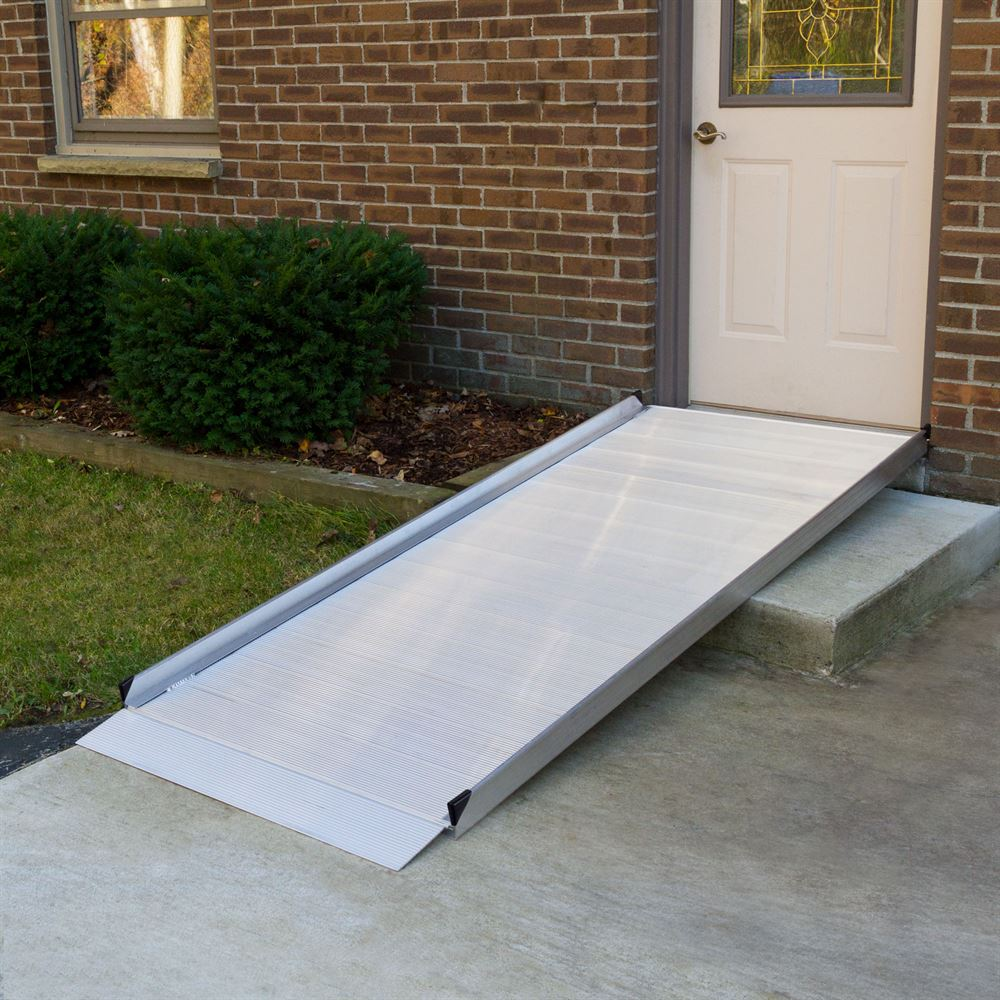
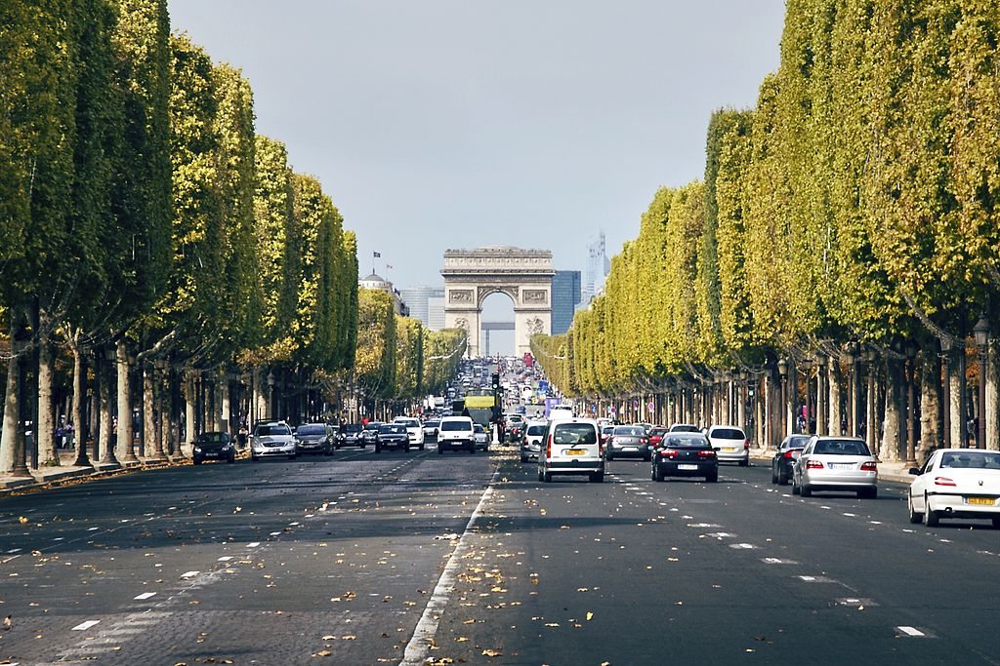
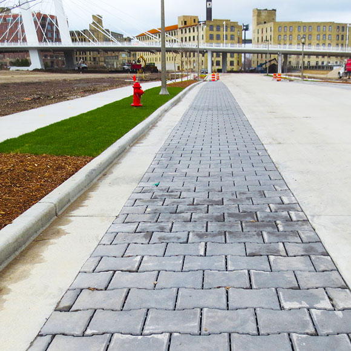

# vehicle road

- ramp: 斜坡；坡道 a slope that joins two parts of a road, path, building, etc. when one is higher than the other

- lane: （乡间）小路 a narrow road in the country 车道 a section of a wide road, that is marked by painted white lines, to keep lines of traffic separate

- avenue: 林荫道（尤指通往大住宅者）a wide straight road with trees on both sides, especially one leading to a big house

- detour: 绕行的路；迂回路；兜圈子 a longer route that you take in order to avoid a problem or to visit a place 临时绕行路；临时支路 a road or route that is used when the usual one is closed

- pavement: （马路边的）人行道 a flat part at the side of a road for people to walk on

## 高速

- expressway: （美国）高速公路(in the US) a wide road that allows traffic to travel fast through a city or other area where many people live
- freeway: （美国）高速公路 (in the US) a wide road, where traffic can travel fast for long distances. You can only enter and leave freeways at special ramps.
- highway: （尤指城镇间的）公路，干道，交通要道 a main road for travelling long distances, especially one connecting and going through cities and towns
- motorway: （英国）高速公路 (in Britain) a wide road, with at least two lanes in each direction, where traffic can travel fast for long distances between large towns. You can only enter and leave motorways at special junctions.

