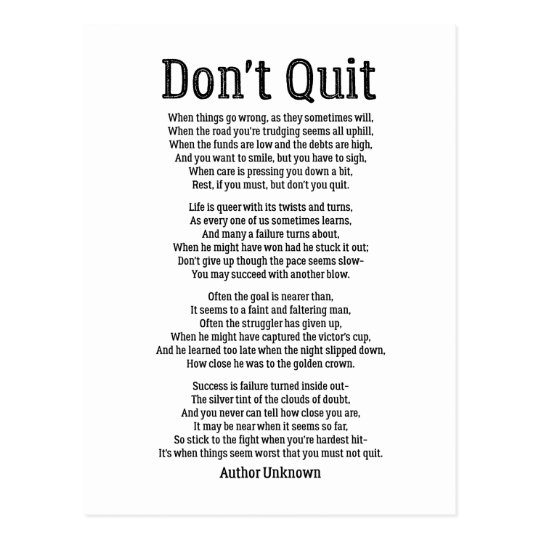

# poetry

关于英语文化中的“poem”和中国传统文化中的“诗”，并不是完全的对等，存在不同的文化差异。

- poetry: 诗集；诗歌；诗作 a collection of poems; poems in general
- poem: 诗；韵文 a piece of writing in which the words are chosen for their sound and the images they suggest, not just for their obvious meanings. The words are arranged in separate lines, usually with a repeated rhythm, and often the lines rhyme at the end.

- poetic: 像诗一般的；富有诗意的 like or suggesting poetry, especially because it shows imagination and deep feeling

- verse: 诗；韵文 writing that is arranged in lines, often with a regular rhythm or pattern of rhyme
