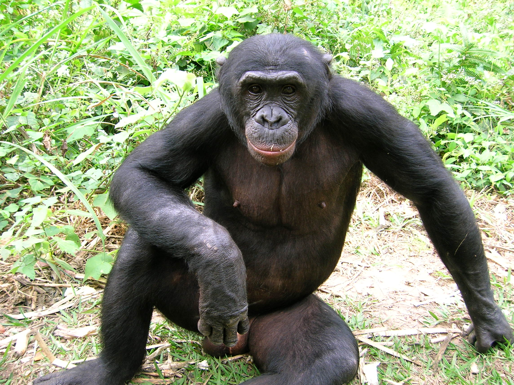

# ape

- Word: ape

- Type: noun [C]
- Meaning: an animal like a large monkey with no tail, that uses its arms to move through trees
- Chinese: 类人猿
- Tags: creature::animal, habitat::forest
- Picture: 

