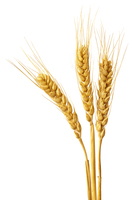

# barley

- Word: barley
- Story: Barley is a grain that's related to the grass family and is used in many foods and drinks. Barley is an important ingredient in making beer.
- Story: Barley is the fourth largest crop grown in the world. It's used to feed grazing livestock, eaten as a whole grain, milled into flour for baking, and dried to make malt, an ingredient in both beer and whisky. The Old English root of barley is bærlic, most likely from a Proto-Indo-European source that means "bristle, point, or projection."

## noun

- Meaning: a tall plant like grass with long, straight hairs growing from the head of each stem, or the grain from this plant, used for food and for making beer and whisky(威士忌)
- Chinese: 大麦
- Tags: food, crop, plant
- Picture: 

