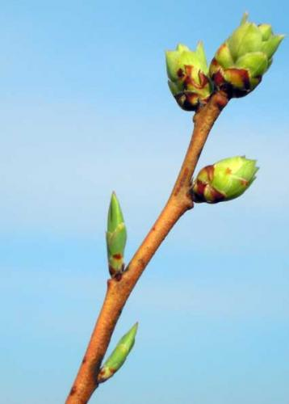

# bud

- Word: bud
- Cognate: 
- Story: 

- Type: noun [C]
- Plural: 
- Single: 
- Comparative: 
- Meaning: a small lump that grows on a plant and from which a flower, leaf or stem develops
- Chinese: 芽；苞；花蕾
- Tags: plant
- Synonyms: 
- Antonyms: 
- Similar: 
- Use: 
- Eg.: the first buds appearing in spring 春天的初芽
- Eg.: The tree is in bud already. 树已发芽。
- Picture: 
- Picture: 

