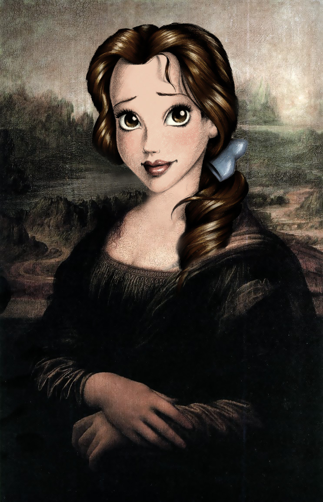

# caricature

- Word: caricature
- Cognate: 
- Story: 

- Type: noun [C]
- Plural: 
- Single: 
- Comparative: 
- Meaning: a funny drawing or picture of sb that exaggerates some of their features; 
- Chinese: 人物漫画；夸张的描述；漫画手法
- Tags: 
- Synonyms: 
- Antonyms: 
- Similar: 
- Use: 
- Eg.: 
- Picture: 

