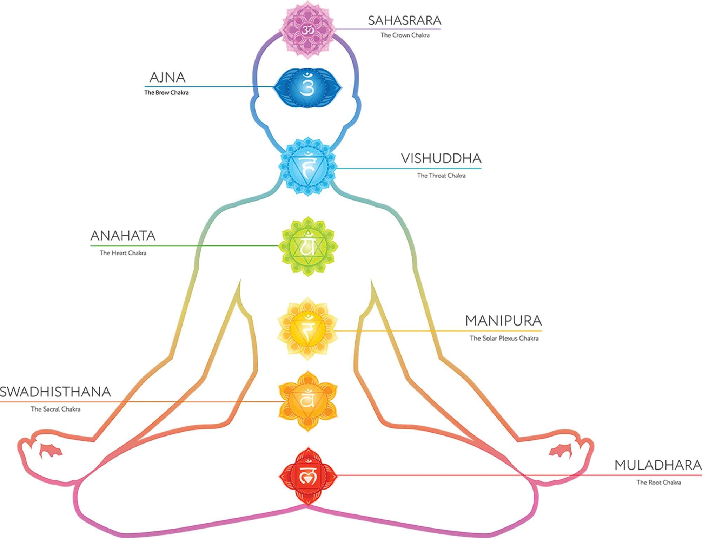

# chakra

- Word: chakra

## noun

- Meaning: any of the seven main areas of spiritual energy in your body, according to a yoga theory
- Chinese: 轮（人体精神集中点之一）
- Tags: energy
- Eg.: The chakra arms around Naruto take now the shape of the fox's head, giving it a ghostly appearance. 脉轮抱住鸣人带形状的狐狸的头，给它一个幽灵般的外观。
- Picture: 

