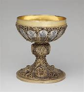

# chalice

- Word: chalice
- Cognate: 
- Story: A chalice is a bowl-shaped drinking vessel. Chalices were all the rage back in King Arthur's day.
- Story: You won't come across the word chalice very often today (outside of books, anyway) unless you hang out at those Renaissance fairs where everyone dresses up as knights. The term "poisoned chalice" is good for describing something that looks beneficial, but is actually harmful.

- Type: noun [C]
- Plural: 
- Single: 
- Comparative: 
- Meaning: a large cup for holding wine, especially one from which wine is drunk in the Christian Communion service
- Chinese: 大酒杯；（尤指基督教的）圣爵
- Tags: 
- Synonyms: 
- Antonyms: 
- Similar: 
- Use: 
- Eg.: 
- Picture: 

