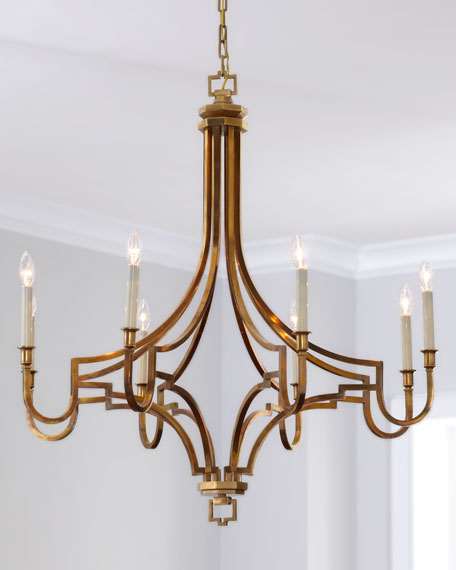

# chandelier

- Word: chandelier
- Cognate: 
- Story: A chandelier is a fancy light fixture that is often ornate and hanging suspended in the middle of a formal space. Walk into a grand ballroom and see a light fixture adorned with sparkling crystals? That's a chandelier.
- Story: The word chandelier comes from the French candere meaning "be white, glisten." Look up at a chandelier and you'll see it glistening and casting white reflections on the walls. The French origin of the word might call up images of palaces like Versailles(凡尔赛宫) in France, where chandeliers hang in nearly every room.

- Type: noun [C]
- Plural: 
- Single: 
- Comparative: 
- Meaning: a large round frame with branches that hold lights or candles . Chandeliers are decorated with many small pieces of glass and hang from the ceiling.
- Chinese: 枝形吊灯
- Tags: 
- Synonyms: 
- Antonyms: 
- Similar: 
- Use: 
- Eg.: 
- Picture: 

