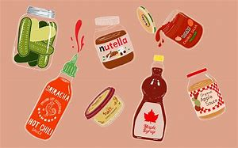

# condiment

- Word: condiment

## noun

- Meaning: a substance such as salt or pepper that is used to give flavour to food; a sauce, etc. that is used to give flavour to food, or that is eaten with food
- Chinese: 调味料；作料；调味汁（或酱等）；酱料
- Tags: food, condiment
- Picture: 

