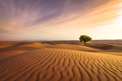

# desert

- Word: desert

- Type: noun [C or U]
- Meaning: an area, often covered with sand or rocks, where there is very little rain and not many plants
- Chinese: 沙漠；荒漠；荒原
- Tags: landscape, nature
- Similar: dessert
- Eg.: 
- Picture: 

