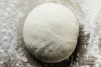

# dough

- Word: dough
- Story: Dough is a thick mixture of flour and other ingredients that can be kneaded(揉；揉捏), baked, and eaten. Bread dough needs to rise before you bake it in a hot oven(烤箱).
- Story: Many baked goods begin their lives as dough, including bread, rolls(面包卷), and some cookies. Dough is stiff(硬的) enough that you can shape it, pull pieces off of it, stretch it and knead it. Informally, dough can also mean "money." If your friend says, "I make so much dough waiting tables!" he probably means money, not cookie dough. The word comes from an Indo-European root that means "smear" or "knead."

- Type: noun [C or U]
- Meaning: flour mixed with water and often yeast(发酵粉；酵母粉), fat(动植物油), or sugar, so that it is ready for baking
- Chinese: （用于制面包和糕点的）生面团
- Tags: food
- Eg.: bread dough
- Eg.: pastry dough
- Eg.: She kneaded the dough and left it to rise.
- Picture: 

