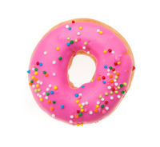

# doughnut

- Word: doughnut
- Story: A doughnut is a delicious, deep-fried breakfast treat. Most doughnuts are round and have a hole in the center. Some have frosting and sprinkles, too.
- Story: You can also call a doughnut a "donut", a slightly more common way to spell it in North America. There are different types of doughnuts, but they're all made of sweet dough that's usually fried (but sometimes baked). Many bakeries that specialize in doughnuts also sell doughnut holes, small enough to pop in your mouth. The very earliest doughnuts were probably the olykoek, or "oil cakes" brought to New York by 19th century Dutch settlers.

## noun

- Meaning: a small, circular cake, fried in hot fat, either with a hole in the middle or filled with jam; a small cake made of fried dough, usually in the shape of a ring, or round and filled with jam/jelly, fruit, cream, etc.
- Chinese: 炸面圈，多纳圈（常含果酱、水果、奶油等）
- Tags: food, child
- Eg.: a jam (us jelly) doughnut
- Picture: 

