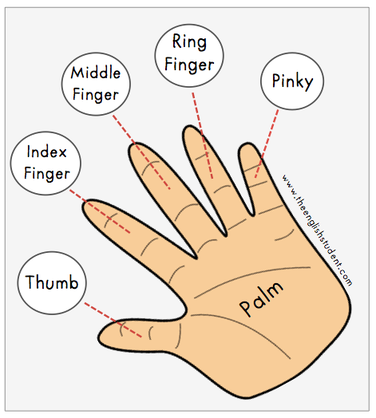

# finger

- Word: finger
- Story: Our fingers help us sense the world around us and manipulate or move things. Using your fingers, you can play the piano, speak in sign language, and flash a peace sign by forming a V with your first two fingers. As a verb, this word means to touch something with your fingers: "He nervously fingers his tie as he waits for his job interview." Finger stems from a root word meaning "five."

- Type: noun [C]
- Meaning: null
- Chinese: null
- Tags: person::hand
- Eg.: thumb 大拇指
- Eg.: index finger 食指
- Eg.: middle finger 中指
- Eg.: ring finger 无名指
- Eg.: pinky or baby finger 小拇指
- Picture: 

