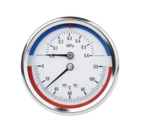

# gauge

- Word: gauge
- Story: If you ask your friend, "How do you feel, generally, about loaning your car to people?" your intention might be to gauge his reaction before you flat-out ask if you can borrow his car. To gauge is to measure or test.

- Type: noun [C]
- Meaning: a device for measuring the amount or size of something
- Chinese: 测量仪器（或仪表）
- Tags: 
- Eg.: a fuel/petrol/temperature, etc. gauge 燃料表、汽油量表、温度计等
- Picture: 

- Type: verb [T]
- Meaning: to measure sth accurately using a special instrument
- Chinese: （用仪器）测量
- Tags: 
- Use: ~ sth
- Eg.: precision instruments that can gauge the diameter to a fraction of a millimetre 可测出直径为若干分之一毫米的精密仪器

- Type: verb [T]
- Meaning: to make a judgement about sth, especially people's feelings or attitudes
- Chinese: 判定，判断（尤指人的感情或态度）
- Tags: 
- Eg.: They interviewed employees to gauge their reaction to the changes.他们与雇员面谈以判定他们的应变能力
- Eg.: He tried to gauge her mood.他试图揣摩她的心情。
- Eg.: It was difficult to gauge whether she was angry or not.很难判断她是否在生气

