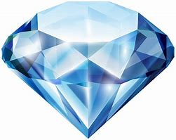

# gem

- Word: gem

- Type: noun [C]
- Meaning: a precious stone that has been cut and polished and is used in jewellery
- Chinese: （经切割打磨的）宝石
- Tags: 
- Similar: germ
- Eg.: a crown studded with gems 镶有宝石的皇冠
- Picture: 

