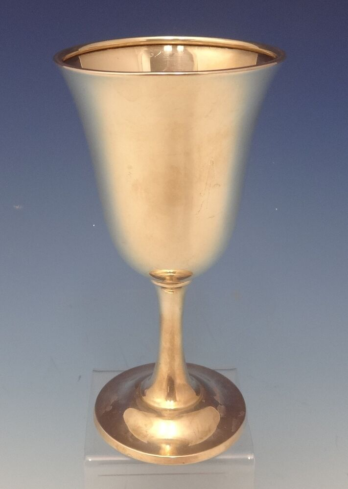

# goblet

- Word: goblet
- Story: A goblet is a fancy, stemmed drinking glass. When you set the table for Thanksgiving dinner, don't forget the water goblets!
- Story: The most common type of goblet is the one you'll see on a holiday table, a glass vessel with a stem that sits on a wide foot. There are goblets meant to hold wine, simple glass goblets, and intricately carved crystal goblets. Long ago, goblets looked completely different — they were short and squat, looking more like bowls than drinking glasses, and made of metal. The Old French root of goblet is gobel, "cup."

## noun

- Meaning: a cup for wine, usually made of glass or metal, with a stem and base but no handle
- Chinese: （玻璃或金属制）高脚酒杯
- Tags: 
- Picture: 

