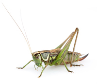

# grasshopper

- Word: grasshopper

- Type: noun [C]
- Meaning: an insect with long back legs, that can jump very high and that makes a sound with its legs
- Chinese: 蝗虫；蚱蜢；蚂蚱
- Tags: creature::insect, habitat::grass
- Eg.: 
- Picture: 

