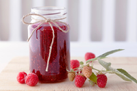

# jam

- Word: jam

## noun

- Meaning: a sweet, soft food made by cooking fruit with sugar to preserve it. It is eaten on bread
- Chinese: 果酱
- Tags: food
- Synonyms: jelly, marmalade
- Eg.: strawberry/raspberry jam
- Eg.: jam sandwiches
- Eg.: a jam doughnut果酱炸面圈
- Picture: 

