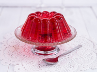

# jelly

- Word: jelly
- Story: Jelly is a sweet preserved form of fruit that's usually made with sugar. Your favorite breakfast might be buttered toast(烤面包片) spread thickly with strawberry jelly.
- Story: Jelly is the close relative to jam and preserves — jelly is typically more translucent than its fruitier cousins, and is sometimes made with juice rather than whole pieces of fruit. Outside of North America, jelly is a dessert(甜食；甜品) made from gelatin(明胶). Jelly comes from the Old French gelee, "jelly" and also "frost," from the verb geler, "to congeal," with its Latin root gelare, "to freeze."

- Type: noun [C or U]
- Meaning: a cold sweet transparent food made from gelatin , sugar and fruit juice, that shakes when it is moved. It is smooth, without any pieces of fruit in it. Jelly is eaten on bread
- Chinese: 果冻
- Tags: food
- Synonyms: jam
- Eg.: a peanut butter and jelly sandwich
- Eg.: apple jelly
- Picture: 

