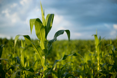

# maize

- Word: maize

## noun

- Meaning: a tall plant grown in many parts of the world for its yellow seeds, which are eaten as food, made into flour, or fed to animals
- Chinese: 玉蜀黍；玉米
- Tags: plant::crop
- Eg.: The villagers cultivate mostly maize and beans.
- Eg.: The villagers grow coffee and maize to sell in the market.
- Picture: 

