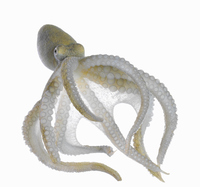

# octopus

- Word: octopus

## noun

- Meaning: a sea creature with a soft, oval body and eight tentacles (= long parts like arms)
- Chinese: 八爪鱼；章鱼
- Tags: creature::animal, habitat::sea
- Picture: 

