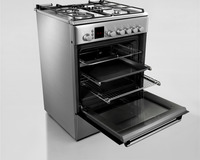

# oven

- Word: oven
- Story: An oven is a device for baking food using heat. You probably scramble eggs on your stove but bake cupcakes in your oven.

- Type: noun [C]
- Meaning: the part of a cooker with a door, used to bake or roast food
- Chinese: 烤箱；烤炉
- Tags: food, tools
- Eg.: a conventional/gas/fan-assisted oven
- Eg.: a microwave oven
- Eg.: a cool/medium/hot oven
- Eg.: Place the cake in the oven at 180°C.
- Picture: 

