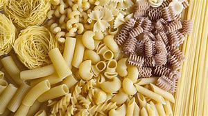

# pasta

- Word: pasta

- Type: noun [U]
- Meaning: a food made from flour, water, and sometimes egg, that is cooked and usually served with a sauce. It is hard when dry and soft when cooked. It is made in various shapes that have different names
- Chinese: 意大利面食 (干的时候，是硬的，熟了之后，是软的)
- Tags: food
- Similar: paste（粘贴）
- Eg.: Spaghetti, lasagne, ravioli, and cannelloni are all types of pasta.
- Picture: 
- Picture: 

